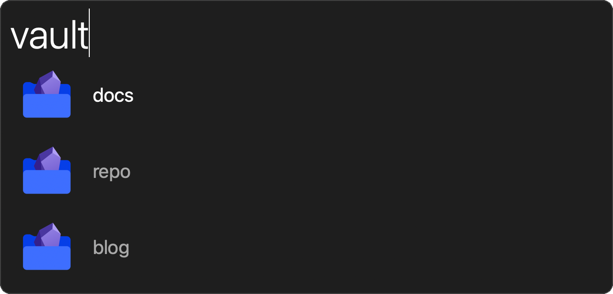

# Vault Launcher



This extension uses Obsidian's [URI support](https://help.obsidian.md/Advanced+topics/Using+Obsidian+URI) to quickly open a specific vault.
It finds previously opened vaults by parsing `~/Library/Application Support/obsidian/obsidian.json`
```javascript
function run() {
  const app = Application.currentApplication()
  app.includeStandardAdditions = true
  
  return JSON.stringify(
    Object
      .values(
        JSON.parse(
          app.read(
            Path("/Users/user/Library/Application\ Support/obsidian/obsidian.json")
          )
        ).vaults
      )
      .map(vault => vault.path)
      .map(path => path.substring(path.lastIndexOf("/") + 1))
      .map(name => ({"arg":name, "title": name}))
      .reduce((result, item) => {
        result.items.push(item)
        return result
      }, {"items": []})
  )
}
```


# Installation

Download the and open [**Obsidian Vault Launcher**](https://github.com/levitatingpineapple/alfred-obsidian-vault-launcher/raw/main/Obsidian%20Vault%20Launcher.alfredworkflow) workflow.